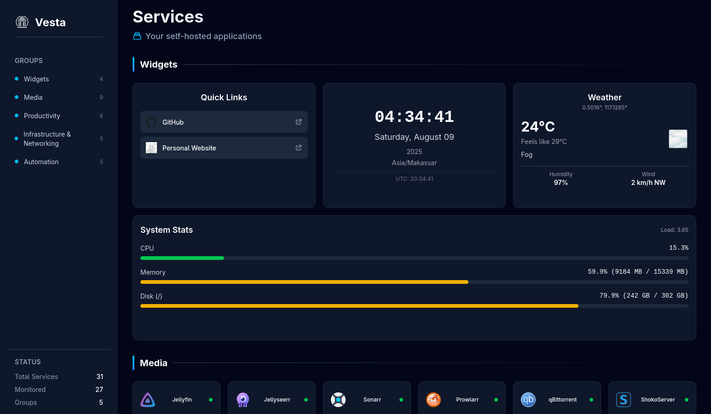

# Vesta

Vesta (named after the Roman goddess of the hearth) is a simple home server dashboard.
It is designed to be simple, and easy to configure.

I make this for my own use, but if you find it useful, feel free to use it.

## Screenshot



Configuration that is used in the screenshot is available in [docs/vesta.toml](docs/vesta.toml).

## Deployment

Docker is the recommended way to deploy Vesta.

```bash
docker run -p 8450:3000 -v /path/to/config/directory:/app/config -v /etc/localtime:/etc/localtime:ro --name vesta ghcr.io/veirt/vesta:latest
```

Or with docker-compose:

```yaml
services:
  vesta:
    container_name: vesta
    image: ghcr.io/veirt/vesta:latest
    ports:
      - 8450:3000
    volumes:
      - /path/to/config/directory:/app/config
      - /etc/localtime:/etc/localtime:ro # to get timezone from host machine
    restart: unless-stopped
```

## Available Widgets

- `QuickLinks`: a list of links that you can customize.
- `Clock`: a simple clock that shows the current time.
- `Weather`: shows the current weather (Open-Meteo).
- `SystemStats`: shows system statistics (CPU, RAM, Disk).
- `SonarrCalendar`: shows the upcoming episodes from Sonarr.

## Credits

- [walkxcode/dashboard-icons](https://github.com/walkxcode/dashboard-icons): as source of the icons.

## Legal

This project is licensed under the GNU General Public License v3.0 - see the [LICENSE](LICENSE) file for details.

All product names, logos, and brands that are shown or mentioned in this project are property of their respective owners.
